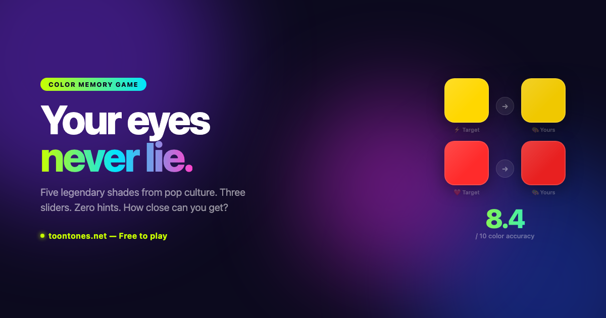

# ToonTones

A free toon tone style color memory game built for instant browser play.

Study a shade, recreate it from memory with HSL sliders, and get a 0-10 color accuracy score.

**Play now:** https://toontones.net

---

## How it works

1. A target shade appears on screen
2. Drag the H / S / L sliders until your mix matches
3. Lock it in and receive a 0-10 score
4. Finish five shades to get your average color accuracy

## Features

- Toon tone inspired color memory gameplay
- Five iconic shades per round
- HSL slider-based color matching
- 0-10 color accuracy score
- Daily color challenge
- Tone Legends leaderboard
- Challenge links for sharing exact rounds
- Shareable score poster
- No signup, no install — scores stored locally in the browser

## Pages

- [Play ToonTones](https://toontones.net/)
- [Toon Tone Game](https://toontones.net/toon-tone-game/)
- [How to Play](https://toontones.net/how-to-play/)
- [Color Memory Game](https://toontones.net/color-memory-game/)
- [Color Accuracy Test](https://toontones.net/color-accuracy-test/)
- [Daily Color Challenge](https://toontones.net/daily-color-challenge/)
- [Tone Legends](https://toontones.net/tone-legends/)

## Stack

Static HTML / CSS / JavaScript. No signup, no download, no app install.

## Live site

**https://toontones.net**

## License

All rights reserved.
